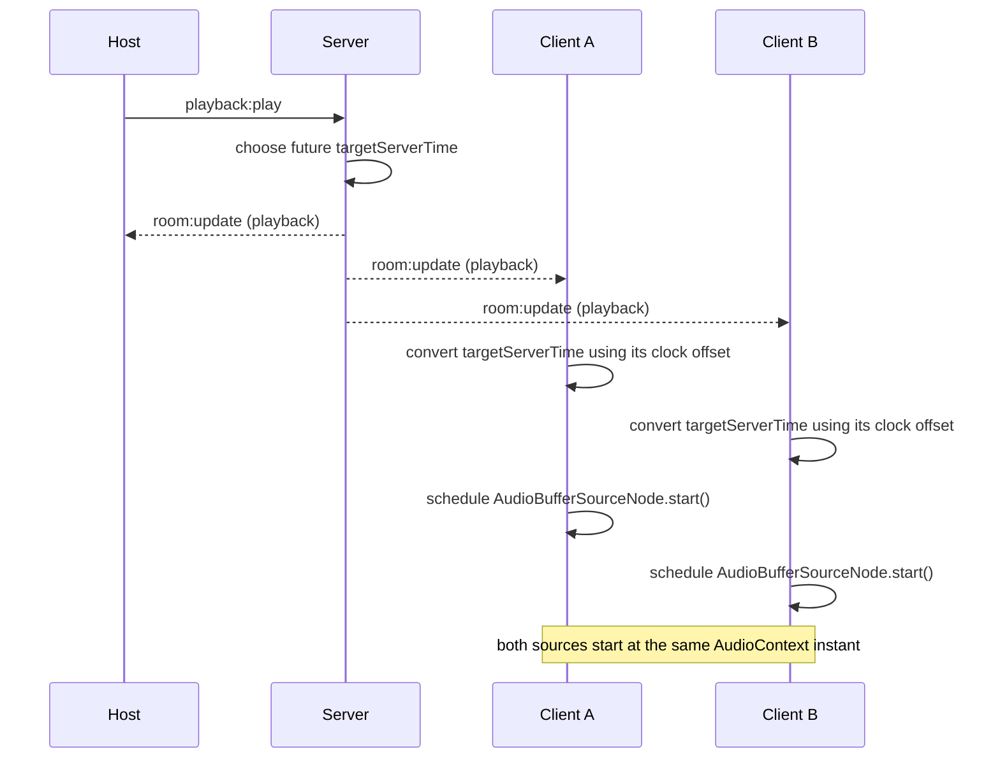

# SyncWave

A real-time multi-device audio synchronization platform that lets multiple
browsers/devices in the same room play locally preloaded audio on a shared,
server-authoritative timeline — synchronized Play/Pause/Seek, drift
correction, a host-controlled queue, and role-based control (primary host /
co-hosts / participants).

**Status: FEATURE COMPLETE — AWAITING FINAL REAL-DEVICE DEBUG/BENCHMARK PASS.**
Everything in this README is implemented and covered by the automated test
suite; the benchmark numbers referenced in `docs/benchmarks.md` and
`docs/cv-metrics.md` are still placeholders pending a dedicated multi-device
test session.

## Project overview

SyncWave is not a live-streaming app. Every device fully downloads and
decodes the same audio file before playback, then the server tells every
device *when* (a future server timestamp) to start/stop/seek, and each
device converts that into its own local `AudioContext` schedule using a
clock-offset estimate. The result is audio that starts together across
devices without needing to stream audio data itself.

## Core features

- **Rooms** — create/join with a 5-character code or an invite link
  (`/room/<CODE>`), no accounts.
- **Audio preload** — full download + `decodeAudioData` before anything
  plays; the immediate-next queued track is preloaded ahead of time too.
- **Synchronized Play/Pause/Seek** — server-authoritative, future-scheduled,
  monotonically versioned.
- **Server-authoritative timeline** — clients never decide playback state on
  their own; they only convert server timestamps into local scheduling.
- **RTT-based clock synchronization** — 9-sample Cristian's-algorithm
  estimate, low-RTT-half + median filtered.
- **Drift monitoring/correction** — periodic per-device self-correction, no
  reliance on server round-trips.
- **Late join / reconnect** — prerequisite-gated recovery that recomputes the
  actual current position, never a stale snapshot.
- **Queue** — server-authoritative, with next-track preload and graceful
  handling of a slow/unready device.
- **Synchronized track transitions** — manual (host "Next") and automatic
  (natural completion), sharing one code path.
- **Host / co-host roles** — primary host, delegated co-hosts, read-only
  participants, with server-enforced authorization and deterministic
  failover.
- **Device calibration** — local output-latency compensation, separate from
  network clock offset.
- **Local volume** — per-device, never affects other participants or
  synchronization.
- **Screen Wake Lock** — best-effort, feature-detected, never blocks
  playback if unsupported.
- **Invite links** — copy room code / copy invite link, no QR dependency
  required.

## Architecture

```mermaid
flowchart LR
    subgraph Devices
        H[Host Browser]
        P1[Participant Browser]
        P2[Participant Browser]
    end

    H <-- Socket.IO --> S[Node.js / Express\nAuthoritative Server]
    P1 <-- Socket.IO --> S
    P2 <-- Socket.IO --> S

    S --> RQ[Room / Queue / Playback State\n(in-memory)]

    subgraph "Inside each browser"
        RC[React Client] --> CS[Clock Sync]
        CS --> WA[Web Audio Scheduling]
        WA --> SPK[Local Speaker]
    end
```

React talks to the server exclusively over Socket.IO (plus one plain HTTP
`POST /api/upload` for file bytes, token-gated). The server holds the only
authoritative copy of room/track/queue/playback state; every client is a
"dumb" renderer of whatever it last received, converted into local Web Audio
scheduling via its own clock-offset estimate.

## Synchronization algorithm

1. **Clock sampling** — each client takes 9 round trips to the server over
   the existing `clock:ping` primitive (Cristian's algorithm:
   `offset = serverTime + rtt/2 - clientReceiveTime`).
2. **RTT filtering** — the lowest-RTT half of the 9 samples is kept (high-RTT
   samples are the least reliable for the symmetric-delay assumption);
   the **median** offset/RTT of that subset becomes the estimate. No single
   sample is ever trusted directly.
3. **Future server timestamp** — every playback command (`play`/`pause`/
   `seek`/queue advance) computes a target `anchorServerTime` roughly 1
   second in the future, not "now." The server never says "play immediately."
4. **Conversion to local scheduling** — each client converts that timestamp
   into a local `AudioContext` delay using its own offset:
   `clientTime = serverTime − offsetMs`, then schedules
   `AudioBufferSourceNode.start()`/`.stop()` against `AudioContext.currentTime`
   — never an immediate call.
5. **Authoritative position extrapolation** — while playing, the canonical
   position is `positionSec + elapsed since anchorServerTime`, computed
   identically on the server and every client, clamped to `[0, duration]`.
6. **Drift monitoring** — every 2s while playing, each device compares its
   own Web Audio scheduling anchor (actual position) against the
   extrapolated authoritative position (expected position).
7. **Threshold correction** — 2 consecutive samples over an 80ms threshold
   trigger a local resync (a fresh scheduled source at the corrected
   position, ~150ms local lead — no server round trip needed since drift is
   inherently per-device), with a 5s cooldown between corrections.

This project does **not** claim NTP-level or sample-perfect precision —
"client-reported drift" (see `docs/benchmarks.md`) is a software timing
estimate, not an acoustic measurement of when sound actually left a speaker.

## Hard engineering problems

- **Variable network latency** — solved with multi-sample RTT
  filtering + median, not a single ping.
- **Stale/out-of-order state** — every authoritative change carries a
  monotonic version; clients (and the server's own internal timers) reject
  anything not strictly newer.
- **Late join** — a joining device is silent until ALL FOUR recovery
  prerequisites hold (room joined, latest state received, track decoded,
  clock synced), then computes its actual current position rather than
  starting from a stale snapshot.
- **Track transition with an unready client** — a device that hasn't
  preloaded the next track must never keep playing the old one; retiring the
  stale source is decoupled from starting the new one (see
  Queue design below).
- **Multi-device join bursts** — membership-only updates must not look like
  playback changes to already-synchronized devices; every scheduling-relevant
  effect is keyed to primitive version fields, not object identity, and
  in-flight clock-sync/decode operations are deduplicated/generation-guarded
  so a slower, earlier operation can never overwrite a newer one's result.
- **Drift** — measured and corrected per-device, independently, without
  coordinating a "vote" across devices (there's nothing to vote on; each
  device's own clock/output-path drifts independently).
- **Host failover** — deterministic (prefers a connected co-host, then the
  longest-connected remaining member), with server-side re-validation of
  privileged tokens at consumption time, not just issue time.
- **Asynchronous decode/recovery ordering** — an in-flight decode/clock-sync
  result that resolves after being superseded is discarded, never applied
  over a newer one.

## Queue design

The server holds `currentTrack` and `queue[]` separately. Each queued track
gets a stable `trackId` (independent of `track.version`, which is the
"how many times has the CURRENT slot been replaced" counter) so next-track
preload readiness can be validated against "is this a report for queue[0],
right now" — a stale report for a since-reordered/removed track is
automatically rejected.

Clients preload **only** the immediate-next track (`queue[0]`), not the
whole queue, to keep memory bounded. When a transition happens (manual Next
or automatic natural completion — the same code path either way):

- A device that already preloaded the next track transitions immediately,
  in sync with every other ready device.
- A device that hasn't finished preloading **retires its old source at the
  authoritative transition instant regardless of its own readiness**, then
  stays silent until decoding catches up, at which point it recovers into
  the new track at the *current* authoritative position — never restarting
  from 0, and never blocking the room for everyone else.

## Testing

```
server tests: 110/110
client tests: 79/79
total: 189/189
```

Run with `npm test` in `server/` and `client/` respectively (see
"Running locally" below for the two-process setup most integration tests
need).

## Benchmark results

See [`docs/benchmarks.md`](docs/benchmarks.md) for the measurement
definitions and procedure, and [`docs/cv-metrics.md`](docs/cv-metrics.md) for
the headline numbers. **Both are placeholder structures (`TO_BE_MEASURED`)
until a real multi-device benchmark session has been run** — no numbers here
are invented.

## Limitations

- Rooms and all state are **in-memory only** — a server restart loses every
  room.
- Uploaded audio files are stored **locally on disk**, not persisted beyond
  the server process's filesystem, and not backed up.
- **No live audio streaming** — every device fully downloads/decodes the
  file before playback; there is no chunked/progressive audio delivery.
- Mobile browsers may **suspend Web Audio when backgrounded** — this app
  cannot guarantee playback continues if the browser tab is not foregrounded
  (Wake Lock keeps the *screen* on where supported, which helps, but is not
  a guarantee against OS-level background suspension).
- **Physical speaker/output-path latency varies by device** and is not
  automatically measured — the optional manual calibration slider lets a
  user compensate for their own device, but nothing auto-detects it.
- **Bluetooth audio adds additional, variable latency** on top of whatever
  a device's calibration offset compensates for.
- Track transitions are synchronized but **not sample-perfect gapless** — a
  short, deliberate scheduling gap (the same ~1s lead as any other playback
  command) separates one track from the next.

## Running locally

Two processes, two terminals:

```bash
# Terminal 1 - backend (Express + Socket.IO), defaults to :3001
cd server
npm install
npm start
```

```bash
# Terminal 2 - frontend (Vite dev server), defaults to :5173, proxies to :3001
cd client
npm install
npm run dev
```

Open the URL Vite prints (typically `http://localhost:5173`). To test across
real devices on the same network, use the "Network:" URL the server prints on
startup instead of `localhost`.

Optional environment overrides (all have working defaults — nothing is
required for local dev):

| Variable | Where | Default | Purpose |
|---|---|---|---|
| `PORT` | server | `3001` | Server listen port |
| `UPLOAD_MAX_FILE_SIZE_MB` | server | `25` | Max upload size |
| `VITE_SERVER_URL` | client (Vite proxy) | `http://localhost:3001` | Backend the dev-server proxy targets |
| `SYNCWAVE_SERVER_URL` | tests | `http://localhost:3001` | Backend the integration tests connect to |

There is currently no production static-file pipeline serving the built
React client from the Express server — `npm run build` in `client/` produces
`client/dist/`, but deploying it (behind a reverse proxy, or wiring Express
to serve it with an SPA fallback for `/room/<code>`) is left as a deployment
step, not automated here.

The original Phase 0 proof-of-concept (a plain-HTML page proving the core
clock-sync/scheduling primitive before the React app existed) is still
served at the server's own root (`http://localhost:3001/`) for low-level
diagnostics — it is clearly labeled as a development page, not the SyncWave
app itself.

## Demo script (60–90 seconds)

1. Create a room on a laptop; open the invite link on a phone and join.
2. Point out the RTT/clock-offset readout in Sync Diagnostics on both.
3. Upload a track, then add a second track to the queue.
4. Press Play — both devices start together.
5. Seek partway through — both devices land on the new position together.
6. Press Next — both devices cut over to the second track together; show the
   queue is now empty.
7. Turn on airplane mode on the phone briefly, then reconnect — show it
   resume in sync without restarting from 0.
8. Promote the phone to co-host, then transfer primary host to it — show the
   laptop still able to control playback as a co-host afterward.

Not every feature needs to appear in one demo — trim to whatever fits the
available time.

## Synchronization sequence


